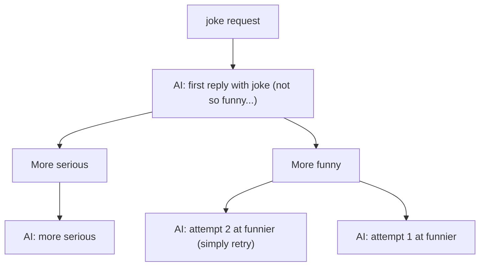

# Nested headings / branching conversation example

This example shows how nested headings represent branching conversations. Please read through it, noting the notes, and then see the diagram at the end.

- In short, the plugin will always trace upwards, in a heading / hierarchy sense, starting from the heading containing the cursor up to the highest level containing heading.
- Ensure that your conversation's starting message is H1 (single `#`). It can be `##` but then there should be nothing above that.
- Headings starting with "AI" or "Assitant" (case insensitive) are tagged as assistant messages, _any_ other headings as user messages.
- Embedded images (not links!) will be correctly base64 encoded and submitted together with text to the OpenAI-style API for multi-modal understanding.

# First message: joke request

Can you tell me a very short joke about taking notes?

## AI: first reply with joke (not so funny...)

Why don't programmers take handwritten notes? They prefer their _memory_ to be _RAM_.

### More serious

can you make it a lot more serious?

#### AI: more serious

Noted. Excessive reliance on digital note-taking may impair cognitive processing and retention of information.

### More funny

can you make it funny?

> [!NOTE]
> _NOTE: with cursor here, the thread will be: `joke request -> AI: first reply -> more funny`. In other words, I can add more sub-headings (more funny, more serious, in space, etc.) to the AI message to try create different branches._

#### AI: attempt 2 at funnier (simply retry)

A student walks into a stationery store and asks for a notebook. The clerk says, "Sorry, we only sell _stationary_ notebooks." The student sighs, "That's okay, I wasn't planning on taking my notes for a walk anyway."

> [!NOTE]
> _NOTE: with cursor somewhere under `More funny` I can keep on invoking `send current thread to AI` and it will keep on adding replies as new children under `More funny`._

#### AI: attempt 1 at funnier

I scribbled a joke about note-taking, but I lost the _Post-it_.

# diagram of the heading hierarchy

> please create a mermaidjs diagram showing the heading hierarchy above clearly. Count the hashes: all headings with the same number of hashes should be on the same level. "more serious" and "more funny" are children of "AI: first reply". Maintain exact heading labels in the diagram, including any "AI:" prefixes.

Here's a Mermaid.js diagram showing the heading hierarchy as requested:

This diagram accurately represents the heading structure, with "More serious" and "More funny" as children of "first reply", and maintains the exact heading labels including "AI:" prefixes where present.
