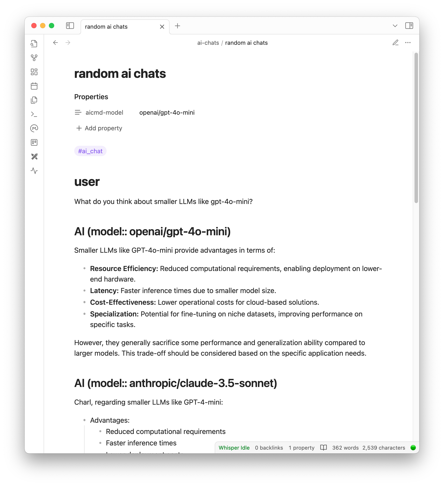

# AI Chat as Markdown screenshots

## Markdown files as system prompts

Here we've added a special "Memories and facts" section to the system prompt markdown file:

Please see the [example system prompt markdown file](./docs/example_system_prompt.md).

## Modular system prompts

Since the 1.5.0 version of the plugin, it supports one level of transclusion / embeds (use `![[my other file]]` in obsidian) in your conversations, but also in your system prompt files!

Here is an example of a modular system prompt where the core prompt is embedded, as well as memories and facts but also two files that change over time: My Emacs org-mode agenda, and my weekly Kanban which is just a markdown file thanks to [the Obsidian Kanban plugin](https://github.com/mgmeyers/obsidian-kanban):

In the following example chat, you can see how it has accessed "live" data from my agenda to help me plan my activities:

You can optionally configure a system prompt file in the frontmatter with the `aicmd-system-prompt-file` variable. This means you can easily setup different (modular) prompts for different notes.

## Locally configure used model in the frontmatter

You can make local changes to the currently used AI model by setting an optional property in the frontmatter. Here I've used it to test both GPT-4o Mini and Claude 3.5 Sonnet on the same stupid question. In this case, I have enabled the optional `Show used model` which will add the used model to each AI heading as a DataView-style hidden inline field.

